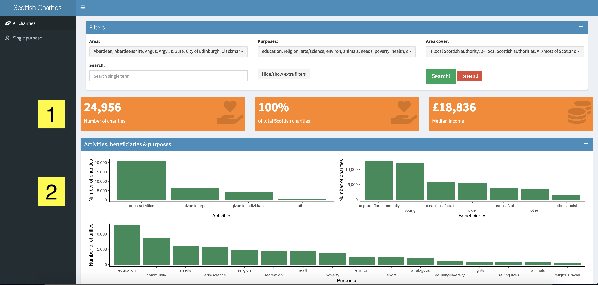
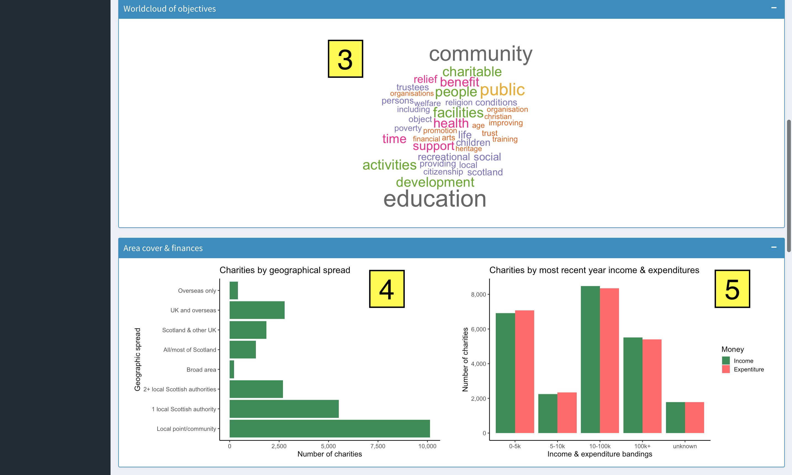
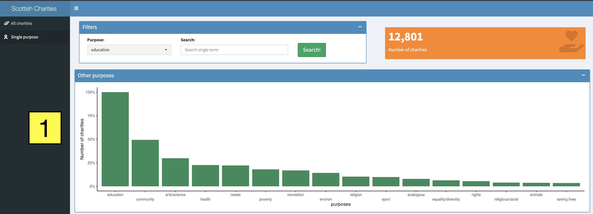
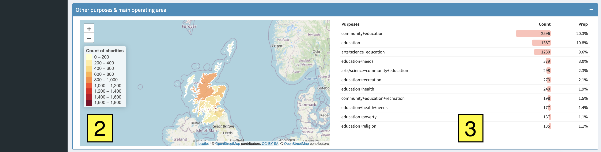

# Scottish Charity Search App

Link to the url of the app: [https://aileen-mcd.shinyapps.io/charity\_data\_app/](https://aileen-mcd.shinyapps.io/charity_data_app/)

This app allows exploration and visualisation of charities in Scotland. It uses information from the Scottish Charity Register (found [here](https://www.oscr.org.uk/about-charities/search-the-register/charity-register-download/)) supplied by the Office of the Scottish Charity Regulator and licensed under the Open Government Licence v.3.0. The licence can be found [here](http://www.nationalarchives.gov.uk/doc/open-government-licence/version/3/). 

Users can not only visualise the data (via charts, maps and high level figures) but also download a subset of the main dataset as csv file to allow further exploration by the user. For more information on the data see the [data dictionary](https://www.oscr.org.uk/media/3788/2018-07-20-description-of-charity-register-download-fields-updated-08_11_2019.pdf). 

## Purpose
To make it easier to get insights and an overview of charities in Scotland at a high level. The app allows users to generate insights and comparisons between different areas and purposes. Users can look at questions and problems such as:

1. How many education charities are in my area that only operate locally?
2. How do the number of sports charities within Edinburgh compare to Stirling? How many of these are for younger people?
3. I want to volunteer to a very small charity (perhaps income less than £10k in the last year) that has a main office close to me. I want to generate a list of these charities and easy links to their websites. 
4. How many charities are there in Scotland who mainly operates overseas and what are their main purposes and recent income/expentiture levels?  

...and many more. 

You might be looking to donate, volunteer or want to know more information about charities in a particular area, with a particular purpose or beneficiary group. Alternatively you might be looking to set up own charity that has a particular purpose and you want to know about other charities are already out there with that purpose in case it's possible to get involved in and/or donate to these.  

I hope this app will help with these searches. 

## What's in the app? 

There are 2 sections to the app: 

### Tab 1 - All charities

This defaults onto data of all Scottish charities registered with the Scottish Chairty Regulator. The user can use the filters to only show particular subsets of the data (and the resulting visualisations) that they are interested in. There are additional filters which can be shown & hidden using the 'Hide/show extra filters' button. All selections can be reset using the 'Reset all' button. The search filter searches for word(s) within the charity name and objectives. **Once the filters have been selected click the 'Search' button** for the filters to be applied (this step is required to help app speed). 

**Note:** if you are looking for a particular type of charity which isn't a pre-defined purpose category (such as health, education etc. - which are defined in the OSCR data) you can use the 'Search' bar in the filters which will allow you to search the charity name and objectives for particular terms - such as 'homelessness' or 'dementia'. 

This tab shows information on (the numbered yellow boxes in the images correspond to the numbered items in this list):

1. **High level figures on number of charities**, % of total Scottish charities and median income of charities (median is taken over the mean because there are some very high income outliers such as universities) 
2. The **number of charities** with each type of **activity** (e.g. does it do activities itself, or does it give to other organisations), **beneficiaries** (e.g. young people, old people etc.) and **purposes** (e.g. education, health etc.). For each of these a single charity can have multiple responses (e.g. can have multiple purposes, activies and beneficiaries) and so the total count of these is much higher than the total number of charities.  

    

3. Wordcloud of objectives (which is taken directly from the charity’s constitution) - the larger the word the more often it appears within the objective statement of the charities. The top 40 most frequent words are shown. 
4. Split of geographical spread - describes how local or widespread the work of the charity is, the graph goes from widest to most local spread. 
5. Split of income and expenditure of most recent year - income and expenditure have been banded into £0-5k, £5-10k, £10-100k, £100k+ and unknowns. 

    

6. Principal Office/Trustees address mapped by postcode. Once arrive at single markers can click on these to see the charity's name and geographical spread. 
7. Mapped count of charities by the local authority area in which the charity’s head office or main operating location lies. Local authority geographic area dervied from open source data (see data source section of README). 
8. Raw data - the data the visualisations are based on. This data also changes with the user filters. The user can download the filtered dataset using the 'download' button and can save to a csv in their downloads folder. The urls in the 'website' field of the dataset are hyperlinks so the user can click directly to charity's website (where it has been provided to the Regulator). The user can also view the table in ascending or descending order of a particular field in the data by clicking on the arrow buttons next to each field title. You can also search for a particular word/term in the filtered data using the search term on the top right of the table (note that this will not change the filtered data and/or visualisations - to do this you want to use the search filter at the top of the page). 

    

Note 1: many of the beneficiaries, activies and purposes have been reduced due to length of text on graphs e.g. '*The advancement of environmental protection or improvement'* is condensed to *'environ'*. For a full list please see 'clean_data/clean_data_values.csv' [here](https://github.com/aileenmcd/scottish_charity_data_app/blob/master/clean_data/clean_data_values.numbers) in the project. 

Note 2: The boxes that hold the visualisations are collapsible using the minimise symbol in the top right hand corner of each box. 

### Tab 2 - Single purpose 
This tab allows the user to get focused information on a single purpose (if they wanted to look into perhaps setting up their own charity and wanted information on what's already out there). The user can select a single purpose from the dropdown list (and also option to include a search term which searches for word(s) within the charity name and objectives). **Once the filters have been selected click the 'Search' button** for the filters to be applied

1. The proportion of charities with other purposes - e.g. if 'single purposes' has been selected can see what % of these charities also have other purposes. This gives an insight into what other objectives these charities have. 

    

2. The main operating areas of the charities for the purposes chosen (similar logic to the map on Tab 1). 

3. Shows the top 10 purpose combinations for the charities with the purposes chosen by user (and the count and proportion of the top 10 combinations). In cases when there are more than 5 purposes the result shows 'more than 5 purposes' to simplify the information. 

## Languages & technologies
Written using [R](https://www.r-project.org/about.html) & [Shiny](https://shiny.rstudio.com/) and deployed onto [shinyapps.io](https://www.shinyapps.io/). Currently have free version of www.shinyapps.io and therefore have a limited amount of time/apps (5 applications & 25 active hours).

## Using the code
Can clone this repo and open the charity_app.Rproj file with R, and run the app via the server.R/global.R/ui.R files. 

## Files & folders 

### App files
* ui.R/server.R/global.R - the 3 files used to create the R Shiny app. 

### Data folders
* raw_data: folder contains raw data from the 3 data sources listed in the data sources section of this README. 
* clean\_data: folder contains clean data that has been created by running the 'scripts/data\_prep.R' file on the raw\_data. 

### Scripts folder
* scripts/data\_prep.R - takes data in 'raw_data' folder and cleans and prepares for use in the app. 
* scripts/functions.R - code to creating 2 functions used within the app. 
* scripts/direct\_data\_downloads.R - this script is not currently used in the app but future plans is to have data download directly from data source websites (listed in data source section of this README) and this has some code which hope to use for this. 

## Data sources

### 1. Scottish Charity Regulator data 
* Full list of all charities on the Scottish Charity Register. 
* Date: 23rd May 2020
* URL: [https://www.oscr.org.uk/about-charities/search-the-register/charity-register-download/](https://www.oscr.org.uk/about-charities/search-the-register/charity-register-download/)
* Data dictionary: [https://www.oscr.org.uk/media/3788/2018-07-20-description-of-charity-register-download-fields-updated-08_11_2019.pdf](https://www.oscr.org.uk/media/3788/2018-07-20-description-of-charity-register-download-fields-updated-08_11_2019.pdf)
* File type: csv 

### 2. Postcode data 
* Latitute and longitute of postcodes in UK that allow mapping of postcodes. 
* Date: 23rd March 2020 (last stated update on website)
* URL: [https://www.freemaptools.com/download-uk-postcode-lat-lng.htm](https://www.freemaptools.com/download-uk-postcode-lat-lng.htm)
* File type: csv 

### 3. Scottish Local Authority boundary data
* Geographic boundary data for Scottish Local Administrative Units Level 1 
* Date: 2011 (most up to date)
* URL: [https://borders.ukdataservice.ac.uk/easy_download.html](https://borders.ukdataservice.ac.uk/easy_download.html)
* File type: shp (shape file)

## Versions 

R version: 4.0.0 (2020-04-24)

|Package| Version |
|---|---|  
|shinycssloaders | 0.3|   
shinyjs|1.1       
rmapshaper|0.4.4     
tidytext|0.2.4     
patchwork|1.0.0     
sf|0.9-3     
lubridate|1.7.8     
formattable|0.2.0.1   
leaflet|2.0.3     
wordcloud|2.6       
RColorBrewer|1.1-2     
tm|0.7-7     
NLP|0.2-0     
shinyWidgets|0.5.1     
DT|0.13      
shinydashboard|0.7.1     
splitstackshape|1.4.8     
janitor|2.0.1     
forcats|0.5.0     
stringr|1.4.0     
dplyr|0.8.5     
purrr|0.3.4     
readr|1.3.1     
tidyr|1.0.3     
tibble|3.0.1     
ggplot2|3.3.0.9
tidyverse|1.3.0     
shiny|1.4.0.2 

Date: 23/05/2020   
Author: [Aileen McDonald](https://twitter.com/mcd_ails)